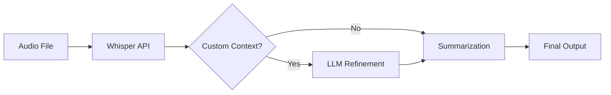

# Two-Pass Transcription System - Implementation Plan

**Status**: 🔄 Ready for Implementation  
**Created**: August 12, 2025  
**Priority**: High  
**Estimated Effort**: 3-4 days

## Executive Summary

This document outlines the implementation plan for enhancing nano-Grazynka's transcription accuracy through a two-pass system. The enhancement addresses a critical issue: Whisper's tendency to misinterpret proper nouns, technical terms, and project-specific vocabulary. By introducing an LLM refinement pass between transcription and summarization, we can significantly improve accuracy while maintaining cost-effectiveness.

## Problem Statement

### Current Issues
1. **Whisper Limitations**: Frequently misinterprets:
   - Company names: "Zabu" → "Zubu"
   - Technical terms: "MCP" → "NCP", "PRD" → "PRT"
   - Project names: "nano-Grazynka" → "Nano Grazinka"
   - Acronyms and domain-specific vocabulary

2. **User Frustration**: Manual correction needed in summaries
3. **Context Loss**: Important entities incorrectly captured

### Solution: Two-Pass Architecture
Introduce an optional LLM refinement pass that uses user-provided context to correct transcription errors before summarization.

## Architecture Design

### Processing Pipeline



### Three-Pass System

#### Pass 1: Raw Transcription (Whisper)
- **Purpose**: Convert audio to text
- **Provider**: OpenAI Whisper API
- **Output**: Raw transcription with potential errors
- **Storage**: Store as `rawText` in database

#### Pass 2: Context-Aware Refinement (Optional)
- **Purpose**: Fix proper nouns and technical terms
- **Provider**: Gemini 2.0 Flash via OpenRouter
- **Trigger**: Only if user provides context
- **Input**: Raw transcription + context section of custom prompt
- **Output**: Refined transcription
- **Storage**: Store as `refinedText` in database

#### Pass 3: Summarization
- **Purpose**: Create structured summary
- **Provider**: Gemini 2.0 Flash via OpenRouter
- **Input**: Refined transcription (or raw if no refinement)
- **Output**: Summary with key points and action items

## Implementation Details

### 1. Frontend Changes

#### A. Update PreviewDialog Component

```typescript
// frontend/components/PreviewDialog.tsx

const SUGGESTED_PROMPT_TEMPLATE = `=== TRANSCRIPTION CONTEXT (for accuracy) ===
Company/Project: [e.g., Zabu, nano-Grazynka]
Technical terms: [e.g., MCP servers, PRD, DDD]
People speaking: [names and roles]
Common corrections: [e.g., "Zabu not Zubu", "MCP not NCP"]

=== SUMMARY INSTRUCTIONS ===
Focus on:
- Key decisions and conclusions
- Action items with owners
- Technical details discussed
- Next steps and deadlines

Language: [if different from audio]
Additional requirements: [any specific needs]`;

// Add change detection
const [templateModified, setTemplateModified] = useState(false);

const handlePromptChange = (value: string) => {
  setCustomPrompt(value);
  setTemplateModified(value !== SUGGESTED_PROMPT_TEMPLATE && value !== '');
};

// Only send if modified
const handleUpload = () => {
  const promptToSend = templateModified ? customPrompt : undefined;
  // ... upload with promptToSend
};
```

#### B. Update Note Detail Page
- Show both raw and refined transcriptions (if available)
- Add toggle to switch between versions
- Display refinement context used

### 2. Backend Changes

#### A. Database Schema Update

```prisma
// backend/prisma/schema.prisma

model Transcription {
  id                String      @id @default(uuid())
  voiceNoteId       String
  rawText           String      @db.Text  // Original Whisper output
  refinedText       String?     @db.Text  // After LLM refinement
  refinementPrompt  String?     @db.Text  // Context used for refinement
  model             String      // Whisper model used
  confidence        Float
  createdAt         DateTime    @default(now())
  updatedAt         DateTime    @updatedAt
  version           Int         @default(1)
  
  voiceNote         VoiceNote   @relation(fields: [voiceNoteId], references: [id])
}
```

#### B. LLMAdapter Enhancement

```typescript
// backend/src/infrastructure/adapters/LLMAdapter.ts

export class LLMAdapter {
  // New method for transcription refinement
  async refineTranscription(
    rawText: string,
    contextPrompt: string
  ): Promise<string> {
    const systemPrompt = `You are a transcription editor specializing in correcting errors in automated transcriptions.
    
Your task:
1. Fix misspelled proper nouns, company names, and technical terms
2. Correct acronyms and domain-specific vocabulary
3. Maintain the exact structure and flow of the original text
4. Only fix clear errors - don't rephrase or restructure
5. Return ONLY the corrected transcription text

Important: Keep the original meaning and structure intact. Only correct obvious transcription errors based on the provided context.`;

    const userPrompt = `Context Information:
${contextPrompt}

Original Transcription:
${rawText}

Please return the corrected transcription:`;

    try {
      const response = await this.callLLM(systemPrompt, userPrompt);
      return this.extractCorrectedText(response);
    } catch (error) {
      this.logger.error('Transcription refinement failed', error);
      return rawText; // Fallback to raw text
    }
  }

  // Helper to parse prompt sections
  parseCustomPrompt(customPrompt: string): {
    contextSection?: string;
    summarySection?: string;
  } {
    const sections = customPrompt.split('=== SUMMARY INSTRUCTIONS ===');
    const contextPart = sections[0]?.replace('=== TRANSCRIPTION CONTEXT (for accuracy) ===', '').trim();
    const summaryPart = sections[1]?.trim();
    
    return {
      contextSection: contextPart || undefined,
      summarySection: summaryPart || undefined
    };
  }
}
```

#### C. ProcessingOrchestrator Update

```typescript
// backend/src/application/services/ProcessingOrchestrator.ts

export class ProcessingOrchestrator {
  async processVoiceNote(
    voiceNote: VoiceNote,
    audioFile: Buffer,
    customPrompt?: string
  ): Promise<void> {
    try {
      // Step 1: Transcription with Whisper
      const rawTranscription = await this.whisperAdapter.transcribe(
        audioFile,
        voiceNote.getLanguage()
      );
      
      // Parse custom prompt if provided
      let contextSection: string | undefined;
      let summarySection: string | undefined;
      
      if (customPrompt) {
        const parsed = this.llmAdapter.parseCustomPrompt(customPrompt);
        contextSection = parsed.contextSection;
        summarySection = parsed.summarySection;
      }
      
      // Step 2: Optional refinement
      let finalTranscription = rawTranscription.text;
      let refinementUsed = false;
      
      if (contextSection && contextSection.length > 10) {
        this.logger.info('Applying transcription refinement');
        finalTranscription = await this.llmAdapter.refineTranscription(
          rawTranscription.text,
          contextSection
        );
        refinementUsed = true;
      }
      
      // Step 3: Store transcription
      const transcription = await this.transcriptionRepo.save({
        voiceNoteId: voiceNote.getId(),
        rawText: rawTranscription.text,
        refinedText: refinementUsed ? finalTranscription : null,
        refinementPrompt: contextSection || null,
        model: rawTranscription.model,
        confidence: rawTranscription.confidence
      });
      
      // Step 4: Summarization
      const summaryResult = await this.llmAdapter.summarize(
        finalTranscription,
        voiceNote.getLanguage(),
        summarySection // Use custom summary instructions if provided
      );
      
      // Step 5: Store summary
      await this.summaryRepo.save({
        voiceNoteId: voiceNote.getId(),
        transcriptionId: transcription.id,
        summary: summaryResult.summary,
        keyPoints: summaryResult.keyPoints,
        actionItems: summaryResult.actionItems,
        model: 'gemini-2.0-flash',
        version: 1
      });
      
      // Step 6: Update voice note status
      voiceNote.markAsCompleted();
      await this.voiceNoteRepo.update(voiceNote);
      
    } catch (error) {
      this.logger.error('Processing failed', error);
      voiceNote.markAsFailed(error.message);
      await this.voiceNoteRepo.update(voiceNote);
      throw error;
    }
  }
}
```

### 3. API Changes

#### A. Update Upload Endpoint
No changes needed - already accepts customPrompt

#### B. Update Get VoiceNote Endpoint
Return both raw and refined transcriptions:

```typescript
// backend/src/presentation/api/routes/voiceNotes.ts

// In getById handler
const transcription = await transcriptionRepo.findLatest(voiceNoteId);
const response = {
  // ... existing fields
  transcription: {
    text: transcription.refinedText || transcription.rawText,
    rawText: transcription.rawText,
    refinedText: transcription.refinedText,
    wasRefined: !!transcription.refinedText,
    refinementContext: transcription.refinementPrompt
  }
};
```

### 4. Cost Analysis

#### Current Costs (per transcription)
- Whisper: ~$0.006 (1 minute audio)
- Gemini Summary: ~$0.0002
- **Total**: ~$0.0062

#### With Refinement (when used)
- Whisper: ~$0.006
- Gemini Refinement: ~$0.0003 (context + transcription)
- Gemini Summary: ~$0.0002
- **Total**: ~$0.0065 (4.8% increase)

#### Cost Optimization
- Only run refinement when context provided
- Cache refinements for identical context
- Batch multiple refinements

## Testing Strategy

### 1. Unit Tests

```typescript
// Test transcription refinement
describe('LLMAdapter.refineTranscription', () => {
  it('should correct known entity names', async () => {
    const raw = 'I work at Zubu corporation on the NCP project';
    const context = 'Company: Zabu\nProjects: MCP';
    const refined = await adapter.refineTranscription(raw, context);
    expect(refined).toContain('Zabu');
    expect(refined).toContain('MCP');
  });
  
  it('should preserve structure when refining', async () => {
    // Test that refinement doesn't change sentence structure
  });
  
  it('should fallback to raw on error', async () => {
    // Test error handling
  });
});
```

### 2. Integration Tests

```typescript
// Test full processing pipeline
describe('ProcessingOrchestrator', () => {
  it('should process without refinement when no context', async () => {
    // Upload without custom prompt
    // Verify only raw transcription stored
  });
  
  it('should apply refinement with context', async () => {
    // Upload with context section
    // Verify both raw and refined stored
  });
  
  it('should use refined text for summary', async () => {
    // Verify summary uses corrected text
  });
});
```

### 3. E2E Tests

1. **Test Case: Zabu Correction**
   - Upload zabka.m4a with context "Company: Zabu"
   - Verify "Zubu" corrected to "Zabu"
   - Check summary uses corrected version

2. **Test Case: Technical Terms**
   - Upload technical discussion
   - Provide acronym context
   - Verify corrections applied

3. **Test Case: No Context**
   - Upload without custom prompt
   - Verify no refinement applied
   - Check performance unchanged

## Rollout Plan

### Phase 1: Backend Implementation (Day 1-2)
1. ✅ Update database schema
2. ✅ Implement LLMAdapter.refineTranscription
3. ✅ Update ProcessingOrchestrator
4. ✅ Add error handling and logging
5. ✅ Write unit tests

### Phase 2: Frontend Implementation (Day 2-3)
1. ✅ Update PreviewDialog with template
2. ✅ Add change detection logic
3. ✅ Update note detail page
4. ✅ Add refinement indicator
5. ✅ Test upload flow

### Phase 3: Testing & Refinement (Day 3-4)
1. ✅ Integration testing
2. ✅ E2E testing with real audio
3. ✅ Performance testing
4. ✅ Cost monitoring
5. ✅ Documentation update

### Phase 4: Deployment
1. ✅ Database migration
2. ✅ Deploy backend changes
3. ✅ Deploy frontend changes
4. ✅ Monitor for issues
5. ✅ Gather user feedback

## Success Metrics

### Accuracy Metrics
- **Entity Recognition**: >95% accuracy for provided entities
- **Technical Terms**: >90% correction rate
- **False Positives**: <5% incorrect "corrections"

### Performance Metrics
- **Refinement Time**: <3 seconds additional
- **Total Processing**: <35 seconds (from 30s)
- **Cost Increase**: <5% when refinement used

### User Metrics
- **Template Usage**: >30% of uploads use context
- **User Satisfaction**: Reduced complaints about transcription errors
- **Feature Adoption**: >50% of regular users utilize feature

## Risk Mitigation

### Risk 1: Over-correction
**Mitigation**: Strict prompt engineering to only fix clear errors

### Risk 2: Increased Costs
**Mitigation**: Only run when context provided, implement caching

### Risk 3: Processing Time
**Mitigation**: Run refinement in parallel with other operations

### Risk 4: LLM Hallucination
**Mitigation**: Validate output length, fallback to raw text

## Future Enhancements

### Phase 2 Features
1. **Context Library**: Save and reuse common contexts
2. **Auto-detection**: Suggest corrections based on history
3. **Bulk Refinement**: Apply context to multiple files
4. **Custom Dictionaries**: User-defined term mappings

### Phase 3 Features
1. **Speaker Diarization**: Identify and label speakers
2. **Multi-language Context**: Support context in different languages
3. **Industry Templates**: Pre-built contexts for common industries
4. **Refinement Analytics**: Show what was corrected

## Conclusion

The two-pass transcription system represents a significant enhancement to nano-Grazynka's core value proposition. By intelligently applying LLM refinement only when needed, we can dramatically improve transcription accuracy for proper nouns and technical terms while maintaining cost-effectiveness. The implementation is designed to be non-disruptive, with graceful fallbacks and clear user control over when refinement is applied.

---
*This plan is ready for implementation following context clearance.*