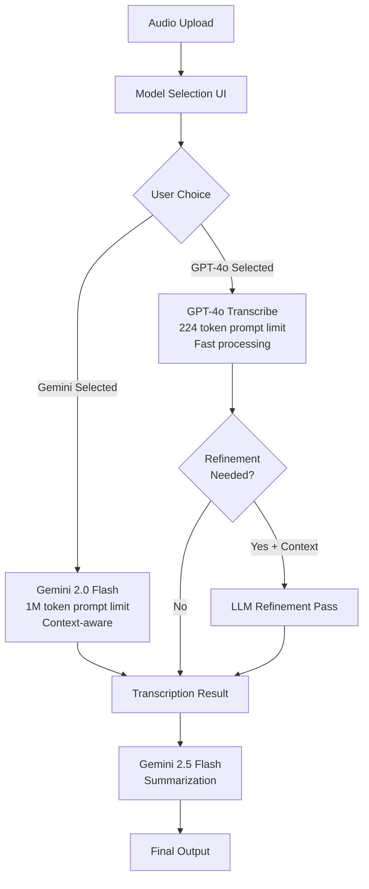

# Unified Multi-Model Transcription Plan

**Status**: 🎯 Ready for Implementation  
**Created**: August 12, 2025  
**Priority**: High  
**Approach**: Progressive Enhancement with Model Selection  
**Estimated Effort**: 4 days

## Executive Summary

This unified plan merges the best aspects of the Two-Pass Transcription and Gemini Integration plans to provide users with choice between fast/simple transcription (GPT-4o-transcribe) and powerful/context-aware transcription (Gemini 2.0 Flash). The plan includes optional refinement for error correction and maintains the existing summarization flow.

## Current State

### ✅ Already Implemented (from Previous Plans)
- **Phase 1 Infrastructure**: `whisperPrompt` field, basic prompt support
- **Phase 2 UI Components**: AdvancedOptions, PostTranscriptionDialog
- **Working Pipeline**: GPT-4o-transcribe → Gemini 2.5 Flash summarization
- **Configuration**: Consolidated config system with multi-provider support

### 🎯 To Be Implemented (This Plan)
- **Model Selection**: Choice between GPT-4o and Gemini 2.0 for transcription
- **Extended Prompts**: Leverage Gemini's 1M token context window
- **Template System**: Pre-built prompts for common scenarios
- **Optional Refinement**: LLM correction pass for GPT-4o errors
- **Adaptive UI**: Interface changes based on selected model

## Architecture Overview

### Processing Flow Diagram



### API Integration Comparison

| Feature | GPT-4o-transcribe | Gemini 2.0 Flash |
|---------|------------------|------------------|
| **Provider** | OpenAI Direct | OpenRouter |
| **Endpoint** | `/v1/audio/transcriptions` | `/v1/chat/completions` |
| **File Format** | Multipart FormData | Base64 encoded in message |
| **Prompt Limit** | 224 tokens | 1,000,000 tokens |
| **Response Limit** | 2,000 tokens | 8,192 tokens |
| **Cost per minute** | $0.006 | $0.0015 (75% cheaper) |
| **Processing Speed** | 5-10 seconds | 10-20 seconds |
| **Best For** | Quick, simple transcriptions | Complex, context-heavy audio |

## Implementation Plan

### Phase 1: Backend Infrastructure (Day 1)

#### 1.1 Database Schema Updates

```prisma
model VoiceNote {
  // ... existing fields ...
  
  // Model selection
  transcriptionModel    String?     @default("gpt-4o-transcribe")
  
  // GPT-4o prompts (existing)
  whisperPrompt        String?     @db.Text  // 224 token limit
  
  // Gemini prompts (new)
  geminiSystemPrompt   String?     @db.Text  // System instructions
  geminiUserPrompt     String?     @db.Text  // User context (1M tokens)
  
  // Refinement tracking (optional)
  refinedText          String?     @db.Text  // After LLM refinement
  refinementPrompt     String?     @db.Text  // Context used for refinement
}
```

#### 1.2 WhisperAdapter Enhancement

Add new method for Gemini transcription:

```typescript
private async transcribeWithGemini(
  audioFilePath: string,
  language: Language,
  options?: {
    prompt?: string;
    systemPrompt?: string;
    temperature?: number;
  }
): Promise<TranscriptionResult> {
  // Read and encode audio as base64
  const audioBuffer = fs.readFileSync(audioFilePath);
  const base64Audio = audioBuffer.toString('base64');
  
  // Construct chat message with audio
  const messages = [
    {
      role: "system",
      content: options?.systemPrompt || this.getDefaultSystemPrompt(language)
    },
    {
      role: "user", 
      content: [
        { type: "text", text: options?.prompt || "Transcribe this audio." },
        { type: "audio", audio: { data: base64Audio, format: mimeType } }
      ]
    }
  ];
  
  // Call OpenRouter with Gemini model
  const response = await fetch('https://openrouter.ai/api/v1/chat/completions', {
    method: 'POST',
    headers: {
      'Authorization': `Bearer ${apiKey}`,
      'Content-Type': 'application/json',
      'HTTP-Referer': 'https://nano-grazynka.app'
    },
    body: JSON.stringify({
      model: 'google/gemini-2.0-flash-001',
      messages,
      temperature: 0.3,
      max_tokens: 8192
    })
  });
  
  return parseGeminiResponse(response);
}
```

#### 1.3 Configuration Updates

```yaml
# config.yaml
transcription:
  defaultModel: gpt-4o-transcribe  # Default selection
  
  models:
    gpt-4o-transcribe:
      provider: openai
      endpoint: /v1/audio/transcriptions
      maxPromptTokens: 224
      responseFormat: json
      
    google/gemini-2.0-flash-001:
      provider: openrouter
      endpoint: /v1/chat/completions
      maxPromptTokens: 1000000
      supportsTemplates: true
      requiresBase64: true
```

### Phase 2: Frontend UI/UX (Day 2)

#### 2.1 Model Selection Component

```typescript
interface ModelSelectionProps {
  selectedModel: TranscriptionModel;
  onModelChange: (model: TranscriptionModel) => void;
}

const ModelSelection: React.FC<ModelSelectionProps> = ({ selectedModel, onModelChange }) => {
  return (
    <div className={styles.modelSelection}>
      <h3>Choose Transcription Model</h3>
      
      <label className={`${styles.modelCard} ${selectedModel === 'gpt-4o-transcribe' ? styles.selected : ''}`}>
        <input
          type="radio"
          value="gpt-4o-transcribe"
          checked={selectedModel === 'gpt-4o-transcribe'}
          onChange={(e) => onModelChange(e.target.value)}
        />
        <div className={styles.modelInfo}>
          <h4>GPT-4o Transcribe</h4>
          <span className={`${styles.badge} ${styles.fast}`}>Fast</span>
          <p>Best for quick, simple transcriptions</p>
          <ul>
            <li>5-10 second processing</li>
            <li>224 token prompt limit</li>
            <li>$0.006/minute</li>
          </ul>
        </div>
      </label>
      
      <label className={`${styles.modelCard} ${selectedModel === 'google/gemini-2.0-flash-001' ? styles.selected : ''}`}>
        <input
          type="radio"
          value="google/gemini-2.0-flash-001"
          checked={selectedModel === 'google/gemini-2.0-flash-001'}
          onChange={(e) => onModelChange(e.target.value)}
        />
        <div className={styles.modelInfo}>
          <h4>Gemini 2.0 Flash</h4>
          <span className={`${styles.badge} ${styles.extended}`}>Extended Context</span>
          <p>Best for complex, context-heavy audio</p>
          <ul>
            <li>10-20 second processing</li>
            <li>1M token prompt capacity</li>
            <li>$0.0015/minute (75% cheaper)</li>
          </ul>
        </div>
      </label>
    </div>
  );
};
```

#### 2.2 Adaptive Prompt Interface

```typescript
// Show different prompt UI based on model
{selectedModel === 'gpt-4o-transcribe' ? (
  <div className={styles.gptPrompt}>
    <label>Transcription Hints (224 tokens max)</label>
    <textarea
      value={whisperPrompt}
      onChange={(e) => setWhisperPrompt(e.target.value)}
      placeholder="Enter proper nouns, technical terms, acronyms..."
      maxLength={900} // ~224 tokens
    />
    <TokenCounter current={whisperPrompt.length / 4} max={224} />
  </div>
) : (
  <div className={styles.geminiPrompt}>
    <TemplateSelector
      onSelect={(template) => setGeminiPrompt(template)}
    />
    <label>Context & Instructions (1M tokens)</label>
    <textarea
      value={geminiPrompt}
      onChange={(e) => setGeminiPrompt(e.target.value)}
      rows={15}
      placeholder={getTemplatePlaceholder(selectedTemplate)}
    />
    <TokenCounter current={geminiPrompt.length / 4} max={1000000} />
  </div>
)}
```

#### 2.3 Template System

```typescript
const PROMPT_TEMPLATES = {
  meeting: {
    name: "Meeting Transcription",
    systemPrompt: "You are a professional meeting transcriber. Focus on accuracy, speaker identification, and action items.",
    userTemplate: `=== MEETING CONTEXT ===
Date: {date}
Attendees: {attendees}
Agenda: {agenda}

=== COMPANY GLOSSARY ===
Company: {company}
Projects: {projects}
Technical terms: {terms}

=== TRANSCRIPTION INSTRUCTIONS ===
1. Include timestamps every 30 seconds
2. Label speakers clearly [Name]:
3. Mark action items with [ACTION]
4. Mark decisions with [DECISION]
5. Note unclear audio with [UNCLEAR]
6. Preserve technical discussions verbatim

=== SPECIAL INSTRUCTIONS ===
{customInstructions}`
  },
  
  technical: {
    name: "Technical Discussion",
    systemPrompt: "You are a technical transcription specialist with expertise in software development.",
    userTemplate: `=== TECHNICAL CONTEXT ===
Domain: {domain}
Technologies: {technologies}
Codebase: {codebase}

=== TERMINOLOGY ===
Frameworks: {frameworks}
Libraries: {libraries}
Common variables: {variables}

=== INSTRUCTIONS ===
1. Preserve code snippets exactly
2. Maintain technical accuracy
3. Include API names and endpoints
4. Note architecture decisions
5. Flag ambiguous technical terms`
  },
  
  podcast: {
    name: "Podcast/Interview",
    systemPrompt: "You are transcribing a podcast or interview. Maintain conversational tone.",
    userTemplate: `=== SHOW INFORMATION ===
Show: {showName}
Host(s): {hosts}
Guest(s): {guests}
Topic: {topic}

=== STYLE GUIDE ===
- Include [LAUGHTER], [PAUSE], [CROSSTALK]
- Add chapter markers for topic changes
- Clean up filler words unless significant
- Preserve personality and tone`
  }
};
```

### Phase 3: Integration & API Updates (Day 3)

#### 3.1 Upload Endpoint Enhancement

```typescript
app.post('/api/voice-notes/upload', async (req, res) => {
  const {
    file,
    language,
    transcriptionModel,  // New: model selection
    whisperPrompt,       // For GPT-4o
    geminiPrompt,        // For Gemini (full prompt)
    summaryPrompt
  } = req.body;
  
  // Validate model
  if (!['gpt-4o-transcribe', 'google/gemini-2.0-flash-001'].includes(transcriptionModel)) {
    return res.status(400).json({ error: 'Invalid transcription model' });
  }
  
  // Parse Gemini prompt if provided
  let geminiSystemPrompt, geminiUserPrompt;
  if (transcriptionModel === 'google/gemini-2.0-flash-001' && geminiPrompt) {
    const template = detectTemplate(geminiPrompt);
    geminiSystemPrompt = template?.systemPrompt || DEFAULT_SYSTEM_PROMPT;
    geminiUserPrompt = geminiPrompt;
  }
  
  // Create voice note with model configuration
  const voiceNote = await createVoiceNote({
    transcriptionModel,
    whisperPrompt: transcriptionModel === 'gpt-4o-transcribe' ? whisperPrompt : null,
    geminiSystemPrompt,
    geminiUserPrompt,
    // ... other fields
  });
  
  // Process with selected model
  await processWithSelectedModel(voiceNote, file);
});
```

#### 3.2 Processing Orchestrator Updates

```typescript
async processVoiceNote(
  voiceNote: VoiceNote,
  audioFile: Buffer,
  customPrompt?: string
): Promise<void> {
  const model = voiceNote.getTranscriptionModel();
  let transcriptionResult: TranscriptionResult;
  
  // Route to appropriate transcription method
  if (model === 'gpt-4o-transcribe') {
    transcriptionResult = await this.whisperAdapter.transcribe(
      audioFile,
      voiceNote.getLanguage(),
      { prompt: voiceNote.getWhisperPrompt() }
    );
    
    // Optional refinement for GPT-4o if context provided
    if (customPrompt && hasRefinementContext(customPrompt)) {
      const refined = await this.refineTranscription(
        transcriptionResult.text,
        extractRefinementContext(customPrompt)
      );
      voiceNote.setRefinedText(refined);
      transcriptionResult.text = refined;
    }
    
  } else if (model === 'google/gemini-2.0-flash-001') {
    // Gemini handles context natively, no refinement needed
    transcriptionResult = await this.whisperAdapter.transcribeWithGemini(
      audioFile,
      voiceNote.getLanguage(),
      {
        systemPrompt: voiceNote.getGeminiSystemPrompt(),
        prompt: voiceNote.getGeminiUserPrompt()
      }
    );
  }
  
  // Continue with existing summarization flow
  await this.summarizeTranscription(transcriptionResult, voiceNote);
}
```

### Phase 4: Optional Refinement & Testing (Day 4)

#### 4.1 LLM Refinement Implementation (Low Priority)

```typescript
// Only implement if users report issues with GPT-4o accuracy
async refineTranscription(
  rawText: string,
  context: string
): Promise<string> {
  const systemPrompt = `You are a transcription editor. Fix only clear errors in proper nouns, technical terms, and acronyms based on the provided context. Do not rephrase or restructure.`;
  
  const userPrompt = `Context:\n${context}\n\nTranscription to correct:\n${rawText}`;
  
  const response = await this.llmAdapter.complete(systemPrompt, userPrompt);
  return response.text;
}
```

#### 4.2 E2E Test Scenarios

```javascript
describe('Multi-Model Transcription', () => {
  test('GPT-4o with short prompt', async () => {
    await selectModel('gpt-4o-transcribe');
    await enterPrompt('Zabu, MCP, nano-Grazynka');
    await uploadFile('test.m4a');
    expect(await getTranscriptionModel()).toBe('gpt-4o-transcribe');
  });
  
  test('Gemini with template', async () => {
    await selectModel('google/gemini-2.0-flash-001');
    await selectTemplate('meeting');
    await fillTemplate({ company: 'Zabu', attendees: 'John, Sarah' });
    await uploadFile('meeting.m4a');
    expect(await getTranscriptionModel()).toBe('google/gemini-2.0-flash-001');
  });
  
  test('Token limit warnings', async () => {
    await selectModel('gpt-4o-transcribe');
    await enterPrompt('a'.repeat(1000));
    expect(await getWarning()).toContain('exceeds 224 tokens');
  });
});
```

## UI/UX Design Specifications

### Visual Hierarchy

```
┌─────────────────────────────────────────────────────┐
│ 🎙️ Upload Voice Note                               │
├─────────────────────────────────────────────────────┤
│ [Drop zone for audio file]                          │
│                                                      │
├─────────────────────────────────────────────────────┤
│ ▼ Advanced Options                                  │
├─────────────────────────────────────────────────────┤
│ Choose Transcription Model:                         │
│                                                      │
│ ┌──────────────────┐  ┌──────────────────┐        │
│ │ ○ GPT-4o         │  │ ○ Gemini 2.0     │        │
│ │   [Fast]         │  │   [Extended]     │        │
│ │   Quick & Simple │  │   Context-Aware  │        │
│ │   224 tokens     │  │   1M tokens      │        │
│ │   $0.006/min     │  │   $0.0015/min    │        │
│ └──────────────────┘  └──────────────────┘        │
│                                                      │
│ [Dynamic prompt interface based on selection]       │
│                                                      │
│ [Upload Button]                                      │
└─────────────────────────────────────────────────────┘
```

### Responsive Design
- **Mobile**: Stack model cards vertically
- **Tablet**: Side-by-side model cards
- **Desktop**: Full horizontal layout with details

## Success Metrics

### Technical Metrics
- **Model Selection Rate**: Track GPT-4o vs Gemini usage
- **Processing Time**: Compare actual vs estimated times
- **Error Rates**: Monitor failures by model
- **Token Usage**: Track prompt sizes and patterns

### User Metrics
- **Template Usage**: >40% of Gemini users use templates
- **Cost Savings**: Average 60% reduction for Gemini users
- **Accuracy Improvement**: Measure entity recognition accuracy
- **User Satisfaction**: >4.5/5 rating for transcription quality

### Business Metrics
- **API Costs**: Track reduction from Gemini adoption
- **Conversion Rate**: Anonymous → registered after using Gemini
- **Feature Adoption**: >30% of users try both models

## Risk Mitigation

### Technical Risks
1. **API Compatibility**: Test both APIs thoroughly
2. **Base64 Encoding**: Optimize for large files
3. **Token Counting**: Implement accurate counting
4. **Model Availability**: Fallback strategies

### User Experience Risks
1. **Complexity**: Progressive disclosure, smart defaults
2. **Cost Confusion**: Clear pricing display
3. **Template Learning Curve**: Helpful examples
4. **Migration**: Preserve existing workflows

## Implementation Checklist

### Backend Tasks
- [ ] Add `transcriptionModel` field to database
- [ ] Implement `transcribeWithGemini()` method
- [ ] Add base64 audio encoding logic
- [ ] Update ProcessingOrchestrator routing
- [ ] Add model-specific configuration
- [ ] Implement prompt parsing utilities
- [ ] Add refinement method (optional)
- [ ] Update API endpoint validations
- [ ] Add observability for model usage

### Frontend Tasks
- [ ] Create ModelSelection component
- [ ] Build adaptive prompt interface
- [ ] Implement template selector
- [ ] Add token counter with visual feedback
- [ ] Update AdvancedOptions component
- [ ] Create template filling UI
- [ ] Add model comparison tooltips
- [ ] Implement responsive layouts
- [ ] Add loading states per model

### Testing Tasks
- [ ] Unit tests for Gemini transcription
- [ ] Integration tests for model routing
- [ ] E2E tests for full flow
- [ ] Performance comparison tests
- [ ] Template validation tests
- [ ] Token counting accuracy tests
- [ ] Error handling scenarios
- [ ] Mobile responsiveness tests

### Documentation Tasks
- [ ] Update API documentation
- [ ] Create model selection guide
- [ ] Document template system
- [ ] Add troubleshooting section
- [ ] Update README with new features

## Timeline Summary

**Day 1**: Backend infrastructure - Gemini method, database updates
**Day 2**: Frontend UI - Model selection, adaptive prompts, templates  
**Day 3**: Integration - API updates, routing, processing flow
**Day 4**: Testing & refinement - E2E tests, optional refinement pass

## Conclusion

This unified plan delivers maximum value by offering users choice and flexibility while maintaining backward compatibility. The combination of fast/simple (GPT-4o) and powerful/context-aware (Gemini) transcription options, along with significant cost savings, positions nano-Grazynka as a premium transcription solution.

---
*This plan supersedes and combines the previous TWO_PASS_TRANSCRIPTION_PLAN and GEMINI_TRANSCRIPTION_PLAN documents.*