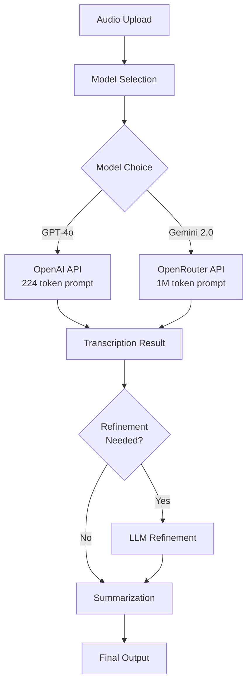

# Gemini 2.0 Flash Transcription Integration Plan

**Status**: 🎯 Ready for Implementation  
**Created**: August 12, 2025  
**Priority**: High  
**Approach**: Progressive Enhancement with Model Selection  
**Estimated Effort**: 3-4 days

## Executive Summary

This plan extends nano-Grazynka's transcription capabilities by introducing Gemini 2.0 Flash as an alternative to GPT-4o-transcribe. The key advantage is Gemini's massive prompt window (1M tokens vs 224 tokens), enabling sophisticated context-aware transcription with detailed instructions, glossaries, speaker lists, and domain-specific guidance.

## Current State vs Target State

### Current State (Phase 1 Complete)
- ✅ GPT-4o-transcribe via OpenAI API (224 token prompt limit)
- ✅ Basic whisperPrompt field in database
- ✅ Gemini 2.5 Flash for summarization via OpenRouter
- ✅ Configuration system consolidated

### Target State
- 🎯 **Model Selection**: Choose between GPT-4o-transcribe and Gemini 2.0 Flash
- 🎯 **Extended Prompts**: Leverage Gemini's 1M token context for detailed instructions
- 🎯 **Smart UI/UX**: Adaptive interface based on selected model
- 🎯 **Template System**: Pre-built prompts for common scenarios
- 🎯 **Unified API**: Both models work through same pipeline

## Architecture Design

### Processing Flow



### API Integration Patterns

| Feature | GPT-4o-transcribe | Gemini 2.0 Flash |
|---------|------------------|------------------|
| Provider | OpenAI Direct | OpenRouter |
| Endpoint | `/v1/audio/transcriptions` | `/v1/chat/completions` |
| File Format | Multipart FormData | Base64 encoded in message |
| Model ID | `gpt-4o-transcribe` | `google/gemini-2.0-flash-001` |
| Prompt Limit | 224 tokens | 1,000,000 tokens |
| Response Limit | 2,000 tokens | 8,192 tokens |
| Cost | ~$0.006/min | ~$0.0015/min |

## Implementation Plan

### Phase 1: Backend Infrastructure (Day 1)

#### 1.1 Configuration Updates

```yaml
# config.yaml
transcription:
  provider: openai  # or 'openrouter'
  model: gpt-4o-transcribe  # or 'google/gemini-2.0-flash-001'
  
  # Model-specific settings
  models:
    gpt-4o-transcribe:
      provider: openai
      maxPromptTokens: 224
      endpoint: /v1/audio/transcriptions
      
    google/gemini-2.0-flash-001:
      provider: openrouter
      maxPromptTokens: 1000000
      endpoint: /v1/chat/completions
      supportsExtendedContext: true
```

#### 1.2 WhisperAdapter Enhancement

```typescript
// Add new method for Gemini transcription
private async transcribeWithGemini(
  audioFilePath: string,
  language: Language,
  options?: {
    prompt?: string;
    systemPrompt?: string;
    temperature?: number;
  }
): Promise<TranscriptionResult> {
  const apiKey = ConfigLoader.get('transcription.apiKey');
  const baseUrl = 'https://openrouter.ai/api/v1';
  
  // Read and encode audio file
  const audioBuffer = fs.readFileSync(audioFilePath);
  const base64Audio = audioBuffer.toString('base64');
  const mimeType = this.getMimeType(audioFilePath);
  
  // Construct message with audio and prompt
  const messages = [
    {
      role: "system",
      content: options?.systemPrompt || this.getDefaultSystemPrompt(language)
    },
    {
      role: "user",
      content: [
        {
          type: "text",
          text: options?.prompt || "Please transcribe this audio accurately."
        },
        {
          type: "audio",
          audio: {
            data: base64Audio,
            format: mimeType
          }
        }
      ]
    }
  ];
  
  const response = await fetch(`${baseUrl}/chat/completions`, {
    method: 'POST',
    headers: {
      'Authorization': `Bearer ${apiKey}`,
      'Content-Type': 'application/json',
      'HTTP-Referer': 'https://nano-grazynka.app',
      'X-Title': 'nano-Grazynka'
    },
    body: JSON.stringify({
      model: 'google/gemini-2.0-flash-001',
      messages,
      temperature: options?.temperature || 0.3,
      max_tokens: 8192
    })
  });
  
  // Parse response
  const result = await response.json();
  return {
    text: result.choices[0].message.content,
    language,
    duration: 0,
    confidence: 0.95
  };
}
```

#### 1.3 Database Schema Update

```prisma
model VoiceNote {
  // ... existing fields ...
  
  // Transcription configuration
  transcriptionModel    String?     @default("gpt-4o-transcribe")
  whisperPrompt        String?     @db.Text
  geminiSystemPrompt   String?     @db.Text  // Extended system prompt for Gemini
  geminiUserPrompt     String?     @db.Text  // Extended user prompt for Gemini
}
```

### Phase 2: Frontend UI/UX (Day 2)

#### 2.1 Enhanced Advanced Options Component

```typescript
// New component structure
interface AdvancedOptionsProps {
  // Model selection
  selectedModel: 'gpt-4o-transcribe' | 'google/gemini-2.0-flash-001';
  onModelChange: (model: string) => void;
  
  // Prompts
  whisperPrompt: string;
  onWhisperPromptChange: (prompt: string) => void;
  
  // Extended prompts for Gemini
  geminiPrompt?: string;
  onGeminiPromptChange?: (prompt: string) => void;
  
  // UI state
  isExpanded: boolean;
  onToggle: () => void;
}
```

#### 2.2 UI Layout Design

```
┌─────────────────────────────────────────────────┐
│ 🎙️ Upload Voice Note                            │
├─────────────────────────────────────────────────┤
│ [Drop zone for audio file]                      │
│                                                  │
├─────────────────────────────────────────────────┤
│ ▼ Advanced Options                              │
├─────────────────────────────────────────────────┤
│ Transcription Model:                            │
│ ○ GPT-4o Transcribe (Fast, 224 token prompt)    │
│ ○ Gemini 2.0 Flash (Extended context, slower)   │
│                                                  │
│ [If GPT-4o selected:]                           │
│ ┌──────────────────────────────────────────┐   │
│ │ Whisper Prompt (224 tokens max)          │   │
│ │ Enter proper nouns, technical terms...   │   │
│ │ [________________________________________]│   │
│ │ 45/224 tokens used                        │   │
│ └──────────────────────────────────────────┘   │
│                                                  │
│ [If Gemini selected:]                           │
│ ┌──────────────────────────────────────────┐   │
│ │ 📋 Prompt Template:                       │   │
│ │ [Dropdown: None/Meeting/Technical/Custom] │   │
│ └──────────────────────────────────────────┘   │
│                                                  │
│ ┌──────────────────────────────────────────┐   │
│ │ Context & Instructions (1M tokens max)   │   │
│ │ [Large textarea with template]           │   │
│ │                                           │   │
│ │ === CONTEXT ===                           │   │
│ │ Company: [Your company]                  │   │
│ │ Project: [Project name]                  │   │
│ │ Speakers: [List speakers]                │   │
│ │                                           │   │
│ │ === GLOSSARY ===                          │   │
│ │ Technical terms: [List terms]            │   │
│ │ Acronyms: [Define acronyms]              │   │
│ │                                           │   │
│ │ === INSTRUCTIONS ===                      │   │
│ │ - Include timestamps                     │   │
│ │ - Label speakers                         │   │
│ │ - Note [UNCLEAR] for ambiguous parts     │   │
│ │                                           │   │
│ │ 2,341 tokens used                        │   │
│ └──────────────────────────────────────────┘   │
│                                                  │
│ [Upload Button]                                  │
└─────────────────────────────────────────────────┘
```

#### 2.3 Prompt Templates

```typescript
const PROMPT_TEMPLATES = {
  meeting: {
    name: "Meeting Transcription",
    systemPrompt: `You are a professional meeting transcriber...`,
    userPrompt: `=== MEETING CONTEXT ===
Date: {date}
Attendees: {attendees}
Agenda: {agenda}

=== GLOSSARY ===
Company terms: {companyTerms}
Project names: {projectNames}

=== TRANSCRIPTION INSTRUCTIONS ===
1. Include timestamps every 30 seconds
2. Label each speaker (e.g., [John]:, [Sarah]:)
3. Note action items with [ACTION]
4. Mark decisions with [DECISION]
5. Flag unclear audio with [UNCLEAR]
6. Preserve all technical discussions verbatim`
  },
  
  technical: {
    name: "Technical Discussion",
    systemPrompt: `You are a technical transcription specialist...`,
    userPrompt: `=== TECHNICAL CONTEXT ===
Domain: {domain}
Technologies: {technologies}
Codebase: {codebase}

=== TERMINOLOGY ===
Frameworks: {frameworks}
Libraries: {libraries}
Variables/Functions: {commonNames}

=== INSTRUCTIONS ===
1. Preserve all code snippets exactly
2. Maintain technical accuracy
3. Include API names, endpoints
4. Note architecture decisions
5. Flag any ambiguous technical terms`
  },
  
  podcast: {
    name: "Podcast/Interview",
    systemPrompt: `You are transcribing a podcast or interview...`,
    userPrompt: `=== SHOW CONTEXT ===
Show: {showName}
Host(s): {hosts}
Guest(s): {guests}
Topic: {topic}

=== STYLE GUIDE ===
- Include [LAUGHTER], [PAUSE], [CROSSTALK]
- Chapter markers every topic change
- Clean up filler words (um, uh) unless significant
- Preserve personality and tone

=== SEGMENTS ===
1. Introduction
2. Main discussion  
3. Q&A (if applicable)
4. Closing`
  }
};
```

### Phase 3: Integration & Testing (Day 3)

#### 3.1 API Updates

```typescript
// Update upload endpoint to handle model selection
app.post('/api/voice-notes/upload', async (req, res) => {
  const { 
    file,
    language,
    transcriptionModel,  // New field
    whisperPrompt,       // For GPT-4o
    geminiPrompt,        // For Gemini
    summaryPrompt
  } = req.body;
  
  // Validate model selection
  const validModels = ['gpt-4o-transcribe', 'google/gemini-2.0-flash-001'];
  if (!validModels.includes(transcriptionModel)) {
    return res.status(400).json({ 
      error: 'Invalid transcription model' 
    });
  }
  
  // Create voice note with model config
  const voiceNote = await createVoiceNote({
    transcriptionModel,
    whisperPrompt: transcriptionModel === 'gpt-4o-transcribe' ? whisperPrompt : null,
    geminiSystemPrompt: transcriptionModel === 'google/gemini-2.0-flash-001' 
      ? extractSystemPrompt(geminiPrompt) : null,
    geminiUserPrompt: transcriptionModel === 'google/gemini-2.0-flash-001'
      ? extractUserPrompt(geminiPrompt) : null,
    // ... other fields
  });
  
  // Process with selected model
  await processWithModel(voiceNote, file, transcriptionModel);
});
```

#### 3.2 Processing Orchestrator Updates

```typescript
async processVoiceNote(
  voiceNote: VoiceNote,
  audioFile: Buffer,
  customPrompt?: string
): Promise<void> {
  const model = voiceNote.getTranscriptionModel();
  
  let transcriptionResult: TranscriptionResult;
  
  if (model === 'gpt-4o-transcribe') {
    // Use existing OpenAI flow
    transcriptionResult = await this.whisperAdapter.transcribe(
      audioFile,
      voiceNote.getLanguage(),
      { prompt: voiceNote.getWhisperPrompt() }
    );
  } else if (model === 'google/gemini-2.0-flash-001') {
    // Use new Gemini flow
    transcriptionResult = await this.whisperAdapter.transcribeWithGemini(
      audioFile,
      voiceNote.getLanguage(),
      {
        systemPrompt: voiceNote.getGeminiSystemPrompt(),
        prompt: voiceNote.getGeminiUserPrompt()
      }
    );
  }
  
  // Continue with refinement and summarization...
}
```

### Phase 4: Testing & Optimization (Day 4)

#### 4.1 E2E Test Scenarios

```javascript
// tests/e2e/gemini-transcription.spec.js

describe('Gemini Transcription', () => {
  test('Should transcribe with Gemini when selected', async () => {
    await page.click('[data-testid="advanced-options"]');
    await page.click('[value="google/gemini-2.0-flash-001"]');
    await page.selectOption('[data-testid="prompt-template"]', 'meeting');
    await page.fill('[data-testid="gemini-prompt"]', customPrompt);
    await uploadFile('test-audio.m4a');
    
    // Verify Gemini was used
    const request = await waitForRequest('/api/voice-notes/upload');
    expect(request.transcriptionModel).toBe('google/gemini-2.0-flash-001');
  });
  
  test('Should handle large prompts with Gemini', async () => {
    const largePrompt = generateLargePrompt(50000); // 50k tokens
    await page.fill('[data-testid="gemini-prompt"]', largePrompt);
    // Should not show error
    expect(await page.locator('.error')).not.toBeVisible();
  });
  
  test('Should show token limit for GPT-4o', async () => {
    await page.click('[value="gpt-4o-transcribe"]');
    await page.fill('[data-testid="whisper-prompt"]', 'a'.repeat(1000));
    // Should show warning
    expect(await page.locator('.token-warning')).toBeVisible();
  });
});
```

#### 4.2 Performance Comparison Tests

```typescript
// tests/performance/model-comparison.test.ts

describe('Model Performance Comparison', () => {
  const testCases = [
    { file: 'short-audio.m4a', duration: 30 },
    { file: 'medium-audio.m4a', duration: 300 },
    { file: 'long-audio.m4a', duration: 1800 }
  ];
  
  for (const testCase of testCases) {
    test(`Compare models for ${testCase.duration}s audio`, async () => {
      // Test GPT-4o
      const gpt4oStart = Date.now();
      const gpt4oResult = await transcribeWithModel(
        testCase.file,
        'gpt-4o-transcribe'
      );
      const gpt4oTime = Date.now() - gpt4oStart;
      
      // Test Gemini
      const geminiStart = Date.now();
      const geminiResult = await transcribeWithModel(
        testCase.file,
        'google/gemini-2.0-flash-001'
      );
      const geminiTime = Date.now() - geminiStart;
      
      console.log({
        file: testCase.file,
        gpt4oTime,
        geminiTime,
        gpt4oLength: gpt4oResult.text.length,
        geminiLength: geminiResult.text.length
      });
    });
  }
});
```

## UI/UX Design Specifications

### Model Selection Interface

1. **Radio Button Group**
   - Clear labels with model capabilities
   - Show prompt limits upfront
   - Estimated processing time
   - Cost indicator (if different)

2. **Progressive Disclosure**
   - Hide complex options until model selected
   - Show relevant fields only
   - Smooth transitions between states

3. **Token Counter**
   - Real-time token counting
   - Visual indicator (green/yellow/red)
   - Suggestions to reduce if over limit

4. **Template System**
   - Dropdown for common scenarios
   - Pre-filled but editable
   - Save custom templates (future)

### Visual Design

```css
/* Model selection cards */
.model-card {
  border: 2px solid transparent;
  padding: 16px;
  border-radius: 8px;
  cursor: pointer;
  transition: all 0.2s;
}

.model-card:hover {
  border-color: var(--primary-color);
  background: var(--hover-bg);
}

.model-card.selected {
  border-color: var(--primary-color);
  background: var(--selected-bg);
}

.model-badge {
  display: inline-block;
  padding: 4px 8px;
  border-radius: 4px;
  font-size: 12px;
  font-weight: 600;
}

.badge-fast { background: #10b981; color: white; }
.badge-extended { background: #3b82f6; color: white; }

/* Token counter */
.token-counter {
  display: flex;
  align-items: center;
  gap: 8px;
  font-size: 14px;
}

.token-bar {
  flex: 1;
  height: 4px;
  background: #e5e7eb;
  border-radius: 2px;
  overflow: hidden;
}

.token-fill {
  height: 100%;
  transition: width 0.3s, background 0.3s;
}

.token-fill.safe { background: #10b981; }
.token-fill.warning { background: #f59e0b; }
.token-fill.danger { background: #ef4444; }
```

### Responsive Design

- **Mobile**: Stack model cards vertically
- **Tablet**: 2-column layout for options
- **Desktop**: Full horizontal layout

## Cost Analysis

### Per-Minute Costs

| Model | Cost/min | Prompt Size | Speed | Quality |
|-------|----------|-------------|-------|---------|
| GPT-4o-transcribe | $0.006 | 224 tokens | Fast (5-10s) | High |
| Gemini 2.0 Flash | $0.0015 | 1M tokens | Medium (10-20s) | High |

### ROI Calculation

- **GPT-4o**: Best for quick, simple transcriptions
- **Gemini**: Best for complex, context-heavy transcriptions
- **Break-even**: Gemini saves money when context prevents 1+ re-transcription

## Migration Strategy

### Phase 1: Soft Launch (Week 1)
- Deploy backend support
- Enable for beta users only
- A/B test with 10% of users

### Phase 2: Gradual Rollout (Week 2)
- Monitor performance metrics
- Adjust based on feedback
- Increase to 50% of users

### Phase 3: Full Release (Week 3)
- Enable for all users
- Default to GPT-4o for simplicity
- Promote Gemini for power users

## Success Metrics

### Technical Metrics
- **Transcription Accuracy**: >95% for provided entities
- **Processing Time**: <20s for 5-min audio
- **API Success Rate**: >99.5%
- **Cost per transcription**: <$0.01 average

### User Metrics
- **Model Selection Rate**: 30% choose Gemini
- **Template Usage**: 40% use templates
- **Error Rate**: <2% failed transcriptions
- **User Satisfaction**: >4.5/5 rating

## Risk Mitigation

### Risk 1: API Compatibility Issues
**Mitigation**: Extensive testing with both APIs, fallback mechanisms

### Risk 2: User Confusion
**Mitigation**: Clear UI labels, helpful tooltips, smart defaults

### Risk 3: Cost Overruns
**Mitigation**: Token limits, usage monitoring, alerts

### Risk 4: Performance Degradation
**Mitigation**: Async processing, queue management, caching

## Implementation Checklist

### Backend Tasks
- [ ] Update config.yaml with model configurations
- [ ] Implement transcribeWithGemini method
- [ ] Update database schema
- [ ] Create model selection logic
- [ ] Add prompt parsing utilities
- [ ] Update ProcessingOrchestrator
- [ ] Add API endpoint changes
- [ ] Implement error handling
- [ ] Add observability logging

### Frontend Tasks
- [ ] Create model selection UI
- [ ] Build template dropdown
- [ ] Implement token counter
- [ ] Add Gemini prompt textarea
- [ ] Update Advanced Options component
- [ ] Add visual indicators
- [ ] Implement responsive design
- [ ] Add loading states
- [ ] Create error messages

### Testing Tasks
- [ ] Unit tests for Gemini adapter
- [ ] Integration tests for model selection
- [ ] E2E tests for full flow
- [ ] Performance comparison tests
- [ ] Template validation tests
- [ ] Token counting tests
- [ ] Error scenario tests
- [ ] Mobile responsiveness tests

### Documentation Tasks
- [ ] Update API documentation
- [ ] Create user guide
- [ ] Document prompt templates
- [ ] Add troubleshooting guide
- [ ] Update README

## Conclusion

This implementation brings significant value by offering users choice between fast, simple transcription (GPT-4o) and sophisticated, context-aware transcription (Gemini 2.0 Flash). The UI/UX design ensures the complexity is manageable while power users can leverage advanced features. The progressive implementation approach minimizes risk while allowing for early feedback and iteration.